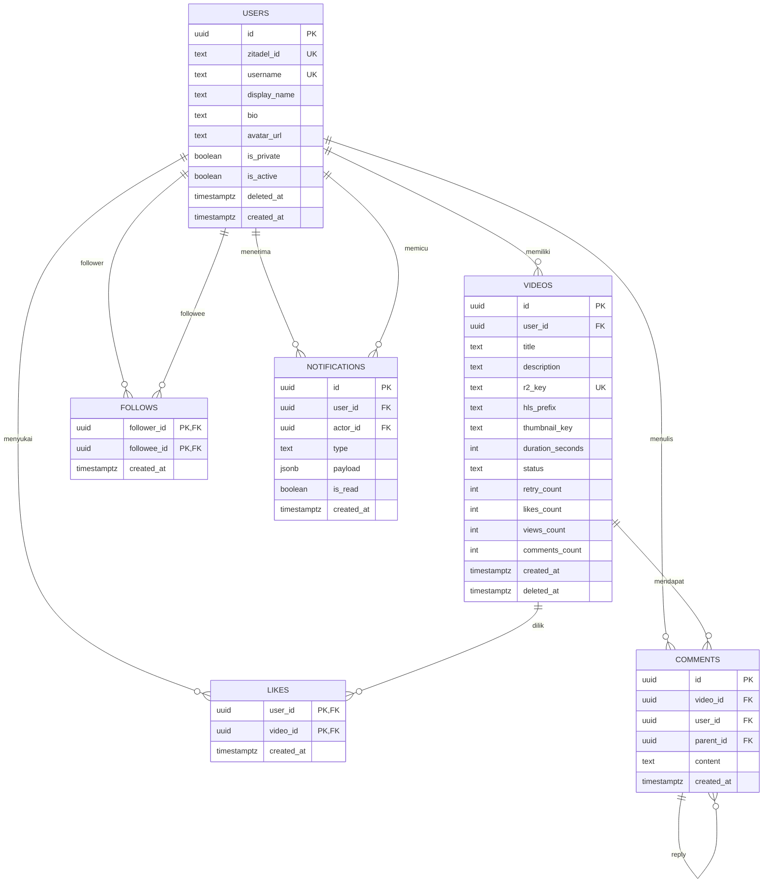

# ERD & Database Schema — TikTok Clone Backend MVP

Dokumen ini adalah turunan langsung dari PRD. Skema memakai **PostgreSQL 16**, **sqlc + pgxpool**, dan **migrasi SQL manual forward-only**.

---

## Asumsi & Catatan Teknis

1. **`user.deleted` dibuat sebagai tombstone, bukan hard delete penuh.**  
   PRD menyatakan `user.deleted` harus menjalankan prosedur penghapusan data lokal. Namun jika baris `users` langsung dihapus, JWT lama yang masih valid bisa membuat user baru lagi lewat `get-or-create` karena `sub` tidak ditemukan. Solusi paling aman:  
   - set `is_active = false`  
   - set `deleted_at = now()`  
   - hapus semua baris terkait: videos, likes, comments, follows, notifications  
   - bersihkan `display_name`, `bio`, `avatar_url`  
   - `username` diubah menjadi placeholder unik seperti `deleted_<uuid>` karena kolom `username` tetap `NOT NULL`

2. **Status `DELETED` pada `videos` tidak langsung menghapus baris.**  
   Video yang dihapus user diberi `status = 'DELETED'` dan `deleted_at = now()`. Cleanup job menghapus file R2 dan baris DB maksimal 1×24 jam, sesuai NFR-13.

3. **Satu record `PENDING_UPLOAD` per user dipaksa di level database.**  
   Untuk memenuhi FR-VIDEO-02b, dipakai partial unique index `videos(user_id) WHERE status = 'PENDING_UPLOAD'`. Request ulang upload-intent tidak akan membuat baris ganda.

4. **Reply comment dipastikan selalu berada di video yang sama.**  
   `parent_id` memakai composite foreign key `(parent_id, video_id) REFERENCES comments(id, video_id)`. Ini mencegah reply nyasar ke video lain.

5. **Tabel `notifications` ditambah kolom `actor_id`.**  
   Ini membantu pembersihan data saat user dihapus dan mempermudah query notifikasi. Detail kontekstual tetap disimpan di `payload JSONB` sebagai snapshot.

6. **Semua index adalah B-Tree.**  
   Tidak ada GIN karena `payload JSONB` tidak dijadikan filter utama. Tidak ada HNSW karena tidak ada vector search.

---

## ERD



---

## DDL Migration — `001_init.sql`

```sql
CREATE EXTENSION IF NOT EXISTS pgcrypto;

CREATE TABLE users (
    id            UUID PRIMARY KEY DEFAULT gen_random_uuid(),
    zitadel_id    TEXT NOT NULL UNIQUE,
    username      TEXT NOT NULL UNIQUE,
    display_name  TEXT,
    bio           TEXT,
    avatar_url    TEXT,
    is_private    BOOLEAN NOT NULL DEFAULT FALSE,
    is_active     BOOLEAN NOT NULL DEFAULT TRUE,
    deleted_at    TIMESTAMPTZ,
    created_at    TIMESTAMPTZ NOT NULL DEFAULT NOW(),
    CONSTRAINT chk_users_deleted_at
        CHECK (deleted_at IS NULL OR is_active = FALSE)
);

CREATE TABLE videos (
    id               UUID PRIMARY KEY DEFAULT gen_random_uuid(),
    user_id          UUID NOT NULL REFERENCES users(id) ON DELETE CASCADE,
    title            TEXT,
    description      TEXT,
    r2_key           TEXT NOT NULL UNIQUE,
    hls_prefix       TEXT,
    thumbnail_key    TEXT,
    duration_seconds INTEGER,
    status           TEXT NOT NULL DEFAULT 'PENDING_UPLOAD',
    retry_count      INTEGER NOT NULL DEFAULT 0,
    likes_count      INTEGER NOT NULL DEFAULT 0,
    views_count      INTEGER NOT NULL DEFAULT 0,
    comments_count   INTEGER NOT NULL DEFAULT 0,
    created_at       TIMESTAMPTZ NOT NULL DEFAULT NOW(),
    deleted_at       TIMESTAMPTZ,
    CONSTRAINT chk_videos_status
        CHECK (status IN ('PENDING_UPLOAD','PROCESSING','READY','FAILED','DELETED')),
    CONSTRAINT chk_videos_retry
        CHECK (retry_count BETWEEN 0 AND 3),
    CONSTRAINT chk_videos_counters
        CHECK (likes_count >= 0 AND views_count >= 0 AND comments_count >= 0),
    CONSTRAINT chk_videos_duration
        CHECK (duration_seconds IS NULL OR (duration_seconds BETWEEN 1 AND 180)),
    CONSTRAINT chk_videos_deleted_at
        CHECK (
            (status = 'DELETED' AND deleted_at IS NOT NULL) OR
            (status <> 'DELETED' AND deleted_at IS NULL)
        )
);

CREATE INDEX idx_videos_user_id
    ON videos(user_id);

CREATE INDEX idx_videos_feed
    ON videos(status, created_at DESC)
    WHERE status = 'READY';

CREATE INDEX idx_videos_deleted_cleanup
    ON videos(status, deleted_at)
    WHERE status = 'DELETED';

CREATE UNIQUE INDEX uq_videos_one_pending_upload_per_user
    ON videos(user_id)
    WHERE status = 'PENDING_UPLOAD';

CREATE TABLE follows (
    follower_id UUID NOT NULL REFERENCES users(id) ON DELETE CASCADE,
    followee_id UUID NOT NULL REFERENCES users(id) ON DELETE CASCADE,
    created_at  TIMESTAMPTZ NOT NULL DEFAULT NOW(),
    PRIMARY KEY (follower_id, followee_id),
    CONSTRAINT chk_follows_no_self
        CHECK (follower_id <> followee_id)
);

CREATE INDEX idx_follows_follower_created
    ON follows(follower_id, created_at DESC);

CREATE INDEX idx_follows_followee_created
    ON follows(followee_id, created_at DESC);

CREATE TABLE likes (
    user_id    UUID NOT NULL REFERENCES users(id) ON DELETE CASCADE,
    video_id   UUID NOT NULL REFERENCES videos(id) ON DELETE CASCADE,
    created_at TIMESTAMPTZ NOT NULL DEFAULT NOW(),
    PRIMARY KEY (user_id, video_id)
);

CREATE INDEX idx_likes_video_created
    ON likes(video_id, created_at DESC);

CREATE TABLE comments (
    id         UUID PRIMARY KEY DEFAULT gen_random_uuid(),
    video_id   UUID NOT NULL REFERENCES videos(id) ON DELETE CASCADE,
    user_id    UUID NOT NULL REFERENCES users(id) ON DELETE CASCADE,
    parent_id  UUID,
    content    TEXT NOT NULL,
    created_at TIMESTAMPTZ NOT NULL DEFAULT NOW(),
    CONSTRAINT chk_comments_content
        CHECK (char_length(content) BETWEEN 1 AND 1000),
    CONSTRAINT uq_comments_id_video
        UNIQUE (id, video_id),
    CONSTRAINT fk_comments_parent
        FOREIGN KEY (parent_id, video_id)
        REFERENCES comments(id, video_id)
        ON DELETE CASCADE
);

CREATE INDEX idx_comments_video_created
    ON comments(video_id, created_at DESC);

CREATE INDEX idx_comments_parent_created
    ON comments(parent_id, created_at DESC)
    WHERE parent_id IS NOT NULL;

CREATE INDEX idx_comments_user_id
    ON comments(user_id, created_at DESC);

CREATE TABLE notifications (
    id         UUID PRIMARY KEY DEFAULT gen_random_uuid(),
    user_id    UUID NOT NULL REFERENCES users(id) ON DELETE CASCADE,
    actor_id   UUID NOT NULL REFERENCES users(id) ON DELETE CASCADE,
    type       TEXT NOT NULL,
    payload    JSONB NOT NULL DEFAULT '{}'::jsonb,
    is_read    BOOLEAN NOT NULL DEFAULT FALSE,
    created_at TIMESTAMPTZ NOT NULL DEFAULT NOW(),
    CONSTRAINT chk_notifications_type
        CHECK (type IN ('follow','like','comment'))
);

CREATE INDEX idx_notifications_user_read_created
    ON notifications(user_id, is_read, created_at DESC);

CREATE INDEX idx_notifications_actor
    ON notifications(actor_id);
```

---

## Penjelasan Tabel dan Kolom

---

### `users`

Menyimpan data profil minimal. **Email dari Zitadel tidak disimpan.**

| Kolom | Tipe Data | Constraint | Default | Keterangan |
|---|---|---|---|---|
| `id` | `UUID` | Primary Key | `gen_random_uuid()` | ID internal. Tidak dijadikan mekanisme keamanan. |
| `zitadel_id` | `TEXT` | NOT NULL, UNIQUE | – | `sub` dari JWT Zitadel. Dipakai untuk get-or-create user. |
| `username` | `TEXT` | NOT NULL, UNIQUE | – | Username publik. Saat tombstone, diganti placeholder unik `deleted_<uuid>`. |
| `display_name` | `TEXT` | NULL | – | Nama tampilan. |
| `bio` | `TEXT` | NULL | – | Bio profil. |
| `avatar_url` | `TEXT` | NULL | – | URL avatar. Hanya referensi; file tetap di R2. |
| `is_private` | `BOOLEAN` | NOT NULL | `FALSE` | Akun private. Jika `TRUE`, hanya follower yang bisa lihat video. |
| `is_active` | `BOOLEAN` | NOT NULL | `TRUE` | `FALSE` untuk user dinonaktifkan/dihapus. Cek di auth middleware. |
| `deleted_at` | `TIMESTAMPTZ` | NULL | – | Diisi saat event `user.deleted`. |
| `created_at` | `TIMESTAMPTZ` | NOT NULL | `NOW()` | Waktu registrasi lokal. |

**Index:**  
- `UNIQUE (zitadel_id)` → B-Tree unique, untuk get-or-create by `sub`.
- `UNIQUE (username)` → B-Tree unique, untuk menjamin username tidak duplikat.

---

### `videos`

Menyimpan metadata video, status transcode, dan lokasi objek di R2.

| Kolom | Tipe Data | Constraint | Default | Keterangan |
|---|---|---|---|---|
| `id` | `UUID` | Primary Key | `gen_random_uuid()` | ID video. |
| `user_id` | `UUID` | NOT NULL, FK → `users.id` ON DELETE CASCADE | – | Pemilik video. |
| `title` | `TEXT` | NULL | – | Judul video. |
| `description` | `TEXT` | NULL | – | Deskripsi video. |
| `r2_key` | `TEXT` | NOT NULL, UNIQUE | – | Object key raw video di R2. |
| `hls_prefix` | `TEXT` | NULL | – | Prefix folder hasil HLS, contoh `hls/{user_id}/{video_id}/`. |
| `thumbnail_key` | `TEXT` | NULL | – | Object key thumbnail R2. |
| `duration_seconds` | `INTEGER` | NULL, CHECK `BETWEEN 1 AND 180` | – | Durasi hasil `ffprobe`. |
| `status` | `TEXT` | NOT NULL, CHECK | `'PENDING_UPLOAD'` | `PENDING_UPLOAD`, `PROCESSING`, `READY`, `FAILED`, `DELETED`. |
| `retry_count` | `INTEGER` | NOT NULL, CHECK `BETWEEN 0 AND 3` | `0` | Berapa kali transcode dicoba. |
| `likes_count` | `INTEGER` | NOT NULL, CHECK `>= 0` | `0` | Counter like, di-update dalam transaksi yang sama dengan tabel `likes`. |
| `views_count` | `INTEGER` | NOT NULL, CHECK `>= 0` | `0` | Counter view. Tidak ada deduplikasi per user. |
| `comments_count` | `INTEGER` | NOT NULL, CHECK `>= 0` | `0` | Total komentar termasuk reply. |
| `created_at` | `TIMESTAMPTZ` | NOT NULL | `NOW()` | Waktu dibuat. Dipakai untuk sorting feed. |
| `deleted_at` | `TIMESTAMPTZ` | NULL, CHECK dengan status | – | Diisi saat `status = 'DELETED'`. Dipakai cleanup 24 jam. |

**Index:**  
- `idx_videos_user_id` → B-Tree `(user_id)`. Mempercepat list video milik user dan operasi cascade.
- `r2_key` UNIQUE → mencegah dua video memakai object key R2 yang sama.
- `idx_videos_feed` → partial B-Tree `(status, created_at DESC) WHERE status = 'READY'`. Mempercepat home feed.
- `idx_videos_deleted_cleanup` → partial B-Tree `(status, deleted_at) WHERE status = 'DELETED'`. Mempercepat cleanup job 1×24 jam.
- `uq_videos_one_pending_upload_per_user` → partial unique `(user_id) WHERE status = 'PENDING_UPLOAD'`. Menjamin tidak ada dua pending upload untuk user yang sama.

---

### `follows`

Relasi follow antar user.

| Kolom | Tipe Data | Constraint | Default | Keterangan |
|---|---|---|---|---|
| `follower_id` | `UUID` | NOT NULL, FK → `users.id` ON DELETE CASCADE | – | User yang mengikuti. |
| `followee_id` | `UUID` | NOT NULL, FK → `users.id` ON DELETE CASCADE | – | User yang diikuti. |
| `created_at` | `TIMESTAMPTZ` | NOT NULL | `NOW()` | Waktu follow. |

**Constraint tambahan:**  
- `PRIMARY KEY (follower_id, followee_id)` → mencegah follow ganda.  
- `CHECK (follower_id <> followee_id)` → mencegah self-follow.

**Index:**  
- `idx_follows_follower_created` → B-Tree `(follower_id, created_at DESC)`. Untuk list following.
- `idx_follows_followee_created` → B-Tree `(followee_id, created_at DESC)`. Untuk list followers dan cek visibility akun private.

---

### `likes`

Relasi like/unlike antara user dan video.

| Kolom | Tipe Data | Constraint | Default | Keterangan |
|---|---|---|---|---|
| `user_id` | `UUID` | NOT NULL, FK → `users.id` ON DELETE CASCADE | – | User yang like. |
| `video_id` | `UUID` | NOT NULL, FK → `videos.id` ON DELETE CASCADE | – | Video yang di-like. |
| `created_at` | `TIMESTAMPTZ` | NOT NULL | `NOW()` | Waktu like. |

**Constraint tambahan:**  
- `PRIMARY KEY (user_id, video_id)` → satu user hanya bisa like satu video sekali.

**Index:**  
- `idx_likes_video_created` → B-Tree `(video_id, created_at DESC)`. Untuk cascade dari video dan query “siapa saja yang like video ini”.

---

### `comments`

Komentar dan reply komentar.

| Kolom | Tipe Data | Constraint | Default | Keterangan |
|---|---|---|---|---|
| `id` | `UUID` | Primary Key | `gen_random_uuid()` | ID komentar. |
| `video_id` | `UUID` | NOT NULL, FK → `videos.id` ON DELETE CASCADE | – | Video tempat komentar berada. |
| `user_id` | `UUID` | NOT NULL, FK → `users.id` ON DELETE CASCADE | – | Penulis komentar. |
| `parent_id` | `UUID` | NULL, FK composite → `comments(id, video_id)` ON DELETE CASCADE | – | Jika diisi, ini adalah reply. |
| `content` | `TEXT` | NOT NULL, CHECK `char_length BETWEEN 1 AND 1000` | – | Isi komentar. |
| `created_at` | `TIMESTAMPTZ` | NOT NULL | `NOW()` | Waktu komentar dibuat. |

**Constraint tambahan:**  
- `UNIQUE (id, video_id)` → dibutuhkan untuk composite FK `parent_id`.
- `FOREIGN KEY (parent_id, video_id) REFERENCES comments(id, video_id)` → memastikan reply selalu berada di video yang sama dan ikut terhapus jika komentar induk dihapus.

**Index:**  
- `idx_comments_video_created` → B-Tree `(video_id, created_at DESC)`. Untuk list komentar per video.
- `idx_comments_parent_created` → partial B-Tree `(parent_id, created_at DESC) WHERE parent_id IS NOT NULL`. Untuk list reply per komentar.
- `idx_comments_user_id` → B-Tree `(user_id, created_at DESC)`. Untuk cleanup saat user dihapus.

---

### `notifications`

Notifikasi in-app untuk event follow, like, dan comment.

| Kolom | Tipe Data | Constraint | Default | Keterangan |
|---|---|---|---|---|
| `id` | `UUID` | Primary Key | `gen_random_uuid()` | ID notifikasi. |
| `user_id` | `UUID` | NOT NULL, FK → `users.id` ON DELETE CASCADE | – | Penerima notifikasi. |
| `actor_id` | `UUID` | NOT NULL, FK → `users.id` ON DELETE CASCADE | – | User yang memicu notifikasi. |
| `type` | `TEXT` | NOT NULL, CHECK | – | `follow`, `like`, atau `comment`. |
| `payload` | `JSONB` | NOT NULL | `'{}'::jsonb` | Snapshot data kontekstual: username, avatar, video_id, comment_id, dll. |
| `is_read` | `BOOLEAN` | NOT NULL | `FALSE` | Status sudah dibaca. |
| `created_at` | `TIMESTAMPTZ` | NOT NULL | `NOW()` | Waktu notifikasi dibuat. |

**Index:**  
- `idx_notifications_user_read_created` → B-Tree `(user_id, is_read, created_at DESC)`. Mempercepat list notifikasi dan mark all read.
- `idx_notifications_actor` → B-Tree `(actor_id)`. Mempercepat pembersihan notifikasi yang dipicu user yang dihapus.

---

## Catatan Penting untuk Implementasi

- `likes_count`, `views_count`, dan `comments_count` adalah **denormalized counter**. Update counter harus dilakukan dalam transaksi yang sama dengan operasi insert/delete di tabel `likes` dan `comments`.
- `follows` tidak punya status `pending/approved`. Untuk MVP, follow langsung aktif. Akun private hanya memengaruhi visibility konten.
- `users.is_private` adalah flag level akun, bukan per-video.
- Pembersihan video `DELETED` dilakukan oleh worker cleanup: cari `videos` dengan `status = 'DELETED'` dan `deleted_at < now() - interval '24 hours'`, hapus file R2, lalu hapus baris.
- Semua akses file HLS/thumbnail harus melalui presigned URL atau signed playlist. Skema hanya menyimpan object key, bukan URL statis.
- Nama tabel dan kolom di atas **dipakai verbatim** oleh `sqlc/queries.sql` dan handler. Tidak ada ORM/GORM.
