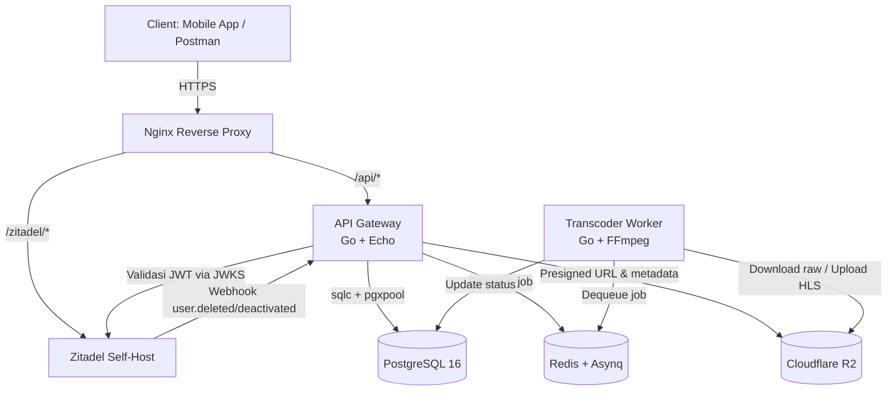

# PRD & Technical Blueprint — TikTok Clone Backend MVP

Dokumen ini adalah acuan utama implementasi. Semua keputusan di bawah sudah mengikuti jawaban discovery. Kalau ada konflik dengan ide awal, yang menang adalah jawaban user.

---

## 1. Overview & Problem

Kita akan membangun **backend ala TikTok untuk MVP** — bukan full TikTok. Targetnya jelas:

- ±1.000 registered users
- 50–100 concurrent user, ramai jam 19:00–23:00 WIB
- 20–50 video per hari, rata-rata durasi 30–60 detik
- ±1.000 video per bulan
- Volume data baru ±2–5 GB/hari
- Budget Rp500.000–700.000/bulan
- Deadline 14 hari, bisa mundur maksimal 3 hari
- Deployment di **satu VPS**, pakai docker-compose
- Konsumen API saat ini: Postman/curl. Mobile app Flutter menyusul, tapi di luar scope MVP

Masalah yang dibereskan PRD ini:

1. Ide awal masih campur-campur antara GORM dan raw SQL — sekarang distandarkan ke **sqlc**.
2. Security belum hardened — sekarang threat report Security Auditor sudah jadi requirement wajib.
3. Alur upload/transcode belum punya validasi konten — padahal ini risiko terbesar.
4. Akses media HLS belum jelas mekanisme privatnya.
5. Keputusan user yang sudah final harus dihormati, bukan diganti seenaknya.

> **Prinsip utama: anti over-engineering.**  
> Tidak ada Kubernetes. Tidak ada microservices. Tidak ada service mesh.  
> Dua service cukup: API Gateway dan Transcoder Worker.

---

## 2. Personas

| Persona | Deskripsi | Kebutuhan |
|---|---|---|
| **Early Adopter** | User awal (±1.000 orang), sebagian besar pemakai Google Sign-In | Lihat feed, upload video pendek, like, comment, follow, terima notifikasi |
| **Stakeholder** | Tim internal yang akan lihat demo day | Feed jalan, upload jalan, transcode selesai < 5 menit, data tidak bocor |
| **Maintainer** | Orang yang develop sekaligus maintain setelah rilis | Bisa deploy manual, log cukup dari stdout, tidak perlu dashboard rumit |

---

## 3. User Stories & Use Cases

| ID | User Story | Prioritas |
|---|---|---|
| US-01 | Sebagai user, saya bisa login via Zitadel (email/password atau Google) dan API otomatis mengenali saya | P0 |
| US-02 | Sebagai user, saya bisa melihat dan mengupdate profil saya | P0 |
| US-03 | Sebagai user, saya bisa upload video 30–60 detik dan melihat status processing sampai READY/FAILED | P0 |
| US-04 | Sebagai user, saya bisa melihat feed video dari akun publik + akun yang saya follow | P0 |
| US-05 | Sebagai user, saya bisa follow/unfollow user lain | P0 |
| US-06 | Sebagai user, saya bisa like/unlike video dan melihat jumlah like | P0 |
| US-07 | Sebagai user, saya bisa comment di video dan menghapus comment milik saya | P0 |
| US-08 | Sebagai user, saya bisa mendapat notifikasi ketika ada yang follow/like/comment ke konten saya | P0 |
| US-09 | Sebagai user, saya bisa menghapus akun beserta semua data saya | P0 |
| US-10 | Sebagai user, saya bisa reply comment | P1 — bisa dikorbankan |
| US-11 | Sebagai user, saya bisa membuat akun private | P1 — bisa dikorbankan |
| US-12 | Sebagai user, saya bisa hapus video saya lewat endpoint publik | P1 — bisa dikorbankan, tapi cleanup internal untuk delete account tetap wajib |

---

## 4. Functional Requirements

### 4.1 Auth & User

| Kode | Requirement |
|---|---|
| FR-AUTH-01 | API **hanya** menerima access token JWT dari Zitadel. Token divalidasi penuh via JWKS: signature, issuer, audience, expiry, dan algoritma. |
| FR-AUTH-02 | **Tidak ada logika refresh token di sisi Go.** Refresh token rotation sepenuhnya ditangani Zitadel. Kalau token expired, API cukup return `401` dan client redirect ke Zitadel. |
| FR-AUTH-03 | Auth middleware melakukan **get-or-create user** berdasarkan `sub` (zitadel_id). Kalau user sudah dinonaktifkan (`is_active = false`), tolak request. |
| FR-AUTH-04 | Zitadel di-self-host via docker-compose terpisah (`../zitadel-compose/`, lihat LLD asumsi A11), dikonfigurasi dengan hosted UI, email/password internal, **dan Google Sign-In**. Compose project MokiBox refer Zitadel sebagai external dependency lewat `ZITADEL_ISSUER_URL`; tidak ada service `zitadel` di MokiBox `docker-compose.yml`. |
| FR-AUTH-05 | Backend wajib menyediakan endpoint webhook Zitadel untuk event `user.deleted` / `user.deactivated`. Webhook wajib diverifikasi signature/secret-nya. Jika event valid, backend harus menonaktifkan user di PostgreSQL (`is_active = false`) untuk `user.deactivated`, atau menjalankan prosedur penghapusan data lokal untuk `user.deleted`. || FR-USER-01 | Endpoint profil: `GET /api/users/me`, `PUT /api/users/me`, `GET /api/users/:id`, `GET /api/users/:id/videos`. |
| FR-USER-02 | Data PII yang disimpan hanya: `username`, `display_name`, `bio`, `avatar_url`. **Email dari Zitadel tidak disimpan di PostgreSQL.** |
| FR-USER-03 | Delete account P0: hapus semua data user (profil, video, like, comment, follow, notifikasi) + file di R2. Penghapusan di Zitadel bisa via UI/admin atau webhook, tapi data lokal harus bersih. |

### 4.2 Upload & Transcode

| Kode | Requirement |
|---|---|
| FR-VIDEO-01 | `POST /api/videos/upload-intent` menghasilkan presigned URL R2 dengan kondisi **`content-length-range`**: minimum 1 KB, maksimum 200 MB. |
| FR-VIDEO-02 | `upload-intent` langsung membuat record video dengan status `PENDING_UPLOAD`. Dengan begitu `confirm` bisa memvalidasi `r2_key` milik user yang benar. |
| FR-VIDEO-02b | Jika presigned URL kadaluarsa sebelum upload selesai, user bisa memanggil ulang `POST /api/videos/upload-intent` untuk mendapatkan URL baru. Record video `PENDING_UPLOAD` tidak boleh ganda; request ulang harus me-reuse record yang sama atau mengganti `r2_key` dengan key baru yang tetap terasosiasi ke user yang sama. |
| FR-VIDEO-03 | `POST /api/videos/confirm` wajib memastikan: video status `PENDING_UPLOAD`, `r2_key` cocok, user pemilik sama, dan objek benar-benar ada di R2. Setelah itu status jadi `PROCESSING` dan job transcode masuk Redis. |
| FR-VIDEO-04 | Worker **wajib validasi file sebelum FFmpeg**: pakai `ffprobe`, cek container, codec, durasi ≤ 180 detik, resolusi wajar, bitrate wajar. Kalau invalid → status `FAILED`, jangan jalankan FFmpeg. |
| FR-VIDEO-05 | Transcode menghasilkan HLS 480p + 720p dan thumbnail dari frame detik ke-1. |
| FR-VIDEO-06 | Job transcode punya timeout. Contoh: video 60 detik harus selesai < 5 menit. Kalau lewat, proses di-kill dan dianggap gagal. |
| FR-VIDEO-07 | Retry transcode maksimal 3x. Setelah itu status `FAILED` permanen. User tidak dapat notifikasi real-time; cukup lihat status. |
| FR-VIDEO-08 | Kalau video dihapus saat antri/diproses, worker **tidak boleh publish hasil transcode**. Cek status video sebelum update DB. |
| FR-VIDEO-09 | Raw video dihapus dari R2 setelah transcode sukses. Untuk video gagal, raw juga dibersihkan. |
| FR-VIDEO-10 | Semua akses media HLS/thumbnail **tidak boleh** lewat URL statis. API mengembalikan presigned URL atau playlist yang sudah ditandatangani. |
| FR-VIDEO-11 | `DELETE /api/videos/:id` bersifat P1 untuk endpoint publik. Tapi fungsi internal delete video + cleanup R2 tetap wajib untuk delete account. |

### 4.3 Feed & Sosial

| Kode | Requirement |
|---|---|
| FR-FEED-01 | `GET /api/feed/home` menampilkan video `READY` dari akun yang di-follow + akun publik, exclude video sendiri, urut `created_at DESC`, limit 20. |
| FR-FEED-02 | Like/unlike dilakukan dalam transaksi DB: insert/delete `likes` + update `likes_count`. |
| FR-FEED-03 | Comment: buat comment, list comment per video, hapus comment (hanya pemilik). `ON DELETE CASCADE` berlaku: hapus comment induk = semua reply ikut terhapus. |
| FR-FEED-04 | Reply comment menggunakan `parent_id` — P1, bisa dipotong kalau waktu mepet. |
| FR-FEED-05 | View tracking: increment `views_count` setiap kali endpoint `POST /api/videos/:id/view` dipanggil. **Tidak ada deduplikasi** per user. Endpoint tetap butuh JWT. |
| FR-FEED-06 | Notifikasi dibuat untuk event follow, like, comment. List notifikasi + mark all read. |

### 4.4 Object-Level Authorization

| Kode | Requirement |
|---|---|
| FR-AUTHZ-01 | Delete video/comment hanya boleh oleh pemilik. |
| FR-AUTHZ-02 | Baca video detail harus cek `is_private` dan relasi follow. Kalau video private dan bukan follower → `403/404`. |
| FR-AUTHZ-03 | Like/comment/follow/unfollow hanya valid kalau target benar-benar ada dan visibility mengizinkan. |
| FR-AUTHZ-04 | **UUID bukan mekanisme keamanan.** Semua authorization dicek di handler, tidak cukup mengandalkan ID acak. |

---

## 5. Non-Functional Requirements

| ID | Requirement |
|---|---|
| NFR-01 | Feed p95 < 500 ms |
| NFR-02 | Like p95 < 200 ms |
| NFR-03 | Upload-intent p95 < 300 ms |
| NFR-04 | Transcode video 60 detik selesai < 5 menit |
| NFR-05 | Uptime target 95%, tanpa SLA ketat |
| NFR-06 | Skala cukup untuk 1.000 user, 50–100 concurrent. Tidak perlu dirancang untuk jutaan user sekarang. |
| NFR-07 | Data baru ±2–5 GB/hari. Kapasitas disk harus cukup untuk growth ±3 bulan ke depan. |
| NFR-08 | Logging cukup stdout dari docker-compose. Tidak perlu structured logging / log collector. |
| NFR-09 | Monitoring cukup manual. Tidak perlu dashboard/alert di MVP. |
| NFR-10 | Deployment manual: `git pull` + `docker-compose up -d --build`. Tidak perlu CI/CD. |
| NFR-11 | Semua komponen jalan di satu VPS, dengan 2 compose project (`docker-compose.yml` MokiBox + `../zitadel-compose/docker-compose.yml` Zitadel). Lihat LLD asumsi A11 untuk deviasi dari NFR-11 awal ("satu docker-compose"): Zitadel v3+ arsitektur multi-service tidak fit di satu compose dengan MokiBox tanpa restart loop. |
| NFR-12 | Data residency bebas. |
| NFR-13 | Retensi: video/akun yang dihapus → file di R2 harus ikut dihapus maksimal 1×24 jam. |
| NFR-14 | Multi-device login diperbolehkan. Tidak perlu fitur logout semua perangkat di MVP. |

---

## 6. High-Level Architecture



Catatan arsitektur:

- **Nginx** adalah satu-satunya pintu masuk dari internet. Hanya port `80/443` yang terbuka.
- **PostgreSQL dan Redis tidak di-publish ke host.** Hanya bisa diakses dari Docker network internal.
- **API Gateway** berisi semua logic bisnis: auth middleware, user, upload intent, feed, sosial, notifikasi.
- **Transcoder Worker** hanya memproses job dari Redis, tidak menerima request HTTP langsung.
- **R2 bucket private.** Semua akses media lewat presigned URL / signed playlist, bukan URL statis.
- Tidak ada service tambahan. Dua service cukup.

---

## 6.5 Security

Berikut threat report dari Security Auditor. Setiap item sudah diterjemahkan menjadi requirement.  
**Semua item dengan severity Critical/High adalah non-negotiable untuk MVP.**

---

### 6.5.1 Malicious Video File → RCE / Crash pada Transcoder Worker

**Severity: Critical**

Threat: user upload file berbahaya yang mengeksploitasi celah parser FFmpeg. Kalau FFmpeg kena CVE, attacker bisa code execution di worker. Worker memegang akses ke R2 dan PostgreSQL.

Mitigasi wajib:

- Jalankan `ffprobe` sebelum FFmpeg untuk memastikan file benar-benar video valid.
- Batasi durasi, resolusi, bitrate, dan codec.
- Jangan percaya `file_size` dari request. Cek ukuran objek aktual di R2.
- Worker jalan sebagai non-root, root filesystem read-only, drop capabilities, resource limit.
- Worker pakai role PostgreSQL terbatas — bukan superuser.
- FFmpeg selalu versi terbaru.
- Set timeout per job, kill proses yang menggantung.

---

### 6.5.2 Redis Queue Exposure / Task Poisoning

**Severity: High**

Threat: Redis kepublish ke `0.0.0.0:6379` tanpa auth. Attacker bisa `FLUSHALL`, atau enqueue task palsu `transcode:video`.

Mitigasi wajib:

- Redis **tidak di-publish ke host**. Hanya bisa diakses dari Docker network internal.
- Aktifkan password/ACL Redis.
- Worker wajib validasi job: `video_id` ada di DB, status masih `PROCESSING`, `r2_key` cocok, sebelum memproses.
- Pisahkan Redis queue dari Redis untuk keperluan lain kalau memungkinkan.

---

### 6.5.3 IDOR pada Endpoint Video, Komentar, dan Sosial

**Severity: High**

Threat: user bisa hapus video/komentar orang lain, atau baca video private, hanya karena tahu UUID.

Mitigasi wajib:

- Terapkan object-level authorization di setiap handler.
- Delete hanya oleh pemilik.
- Baca video detail harus cek `is_private` dan relasi follow.
- Jangan mengandalkan UUID sebagai keamanan.

---

### 6.5.4 Webhook Zitadel Tanpa Verifikasi

**Severity: High**

Threat: attacker memanggil endpoint webhook dan mengirim event `user.deleted` palsu. Backend bisa menghapus akun dan semua data user.

Mitigasi wajib:

- Verifikasi signature/secret webhook Zitadel dengan constant-time comparison.
- Endpoint webhook hanya via HTTPS.
- Rate limit endpoint webhook.
- Log semua event webhook untuk audit sederhana.

---

### 6.5.5 R2 Bucket Misconfigured / URL Statis

**Severity: High**

Threat: kalau bucket public-read atau API mengembalikan URL statis, semua video — termasuk private — bisa diakses siapa saja.

Mitigasi wajib:

- Bucket R2 **private**.
- API tidak pernah mengembalikan URL statis.
- Semua file media diakses lewat presigned URL berumur pendek.
- Khusus HLS, API bisa mengembalikan playlist `.m3u8` yang sudah di-rewrite untuk berisi presigned URL segmen `.ts`.

---

### 6.5.6 JWT/Zitadel Misconfiguration

**Severity: High**

Threat: validasi JWT custom yang tidak cek signature/issuer/audience/alg. Atau token bocor karena HTTP.

Mitigasi wajib:

- Gunakan library OIDC resmi, misal `coreos/go-oidc`.
- Validasi signature via JWKS Zitadel, cek issuer, audience, expiry, dan `alg` yang diizinkan.
- Tolak token `alg: none` dan `HS256` pada token yang harusnya RSA.
- Seluruh traffic API via HTTPS. Aktifkan HSTS di Nginx.
- Zitadel issuer URL pakai domain publik yang benar dan tidak diubah-ubah sembarangan.

---

### 6.5.7 Upload Tanpa Batas Ukuran/Konten

**Severity: High**

Threat: presigned URL tidak dibatasi ukuran, user bisa upload file raksasa atau non-video. Disk VPS bisa penuh, biaya R2 membengkak.

Mitigasi wajib:

- Presigned URL memakai condition `content-length-range`.
- Batas maksimal 200 MB.
- `confirm` memvalidasi ukuran aktual objek R2 sesuai klaim.
- Worker batasi durasi video dan punya timeout.

---

### 6.5.8 Rate Limiting Endpoint Sosial

**Severity: Medium**

Bisa mengakibatkan spam like/comment/follow dan notification bombing.  
Tidak wajib di MVP, tapi kalau sempat, tambahkan rate limiter sederhana per user untuk endpoint mutasi.

---

### 6.5.9 Default Credentials & Port Internal Terbuka

**Severity: Medium**

Ganti semua default password, jangan publish port PostgreSQL/Redis ke host, aktifkan firewall, dan jangan commit `.env` ke repo.

---

### 6.5.10 Brute-Force pada Zitadel Self-Host

**Severity: Medium**

Aktifkan rate limit login, lockout, password policy kuat, dan MFA untuk stakeholder di Zitadel.

---

### Prioritas Wajib untuk MVP

Ini **tidak bisa ditawar**. Semua harus selesai sebelum demo:

| ID | Security Requirement | Severity Asal |
|---|---|---|
| SEC-01 | Validasi file dengan `ffprobe` sebelum transcode; batasi ukuran/durasi/bitrate | Critical |
| SEC-02 | Isolasi worker: non-root, read-only FS, resource limit, DB role terbatas, timeout | Critical |
| SEC-03 | Redis internal-only, dengan auth, validasi job di worker | High |
| SEC-04 | Object-level authorization di semua endpoint video/komentar/sosial | High |
| SEC-05 | Verifikasi signature webhook Zitadel | High |
| SEC-06 | R2 bucket private; semua akses media via presigned URL/signed playlist | High |
| SEC-07 | Validasi JWT via OIDC library + HTTPS only | High |
| SEC-08 | Presigned URL upload dibatasi `content-length-range`, cek ukuran aktual di confirm | High |

---

## 7. Tech Stack & Justifikasi

Semua keputusan di bawah mengikuti jawaban discovery user.  
Yang belum sempat dikonfirmasi user ditandai **🔶 Asumsi**.

| Layer | Teknologi | Alasan |
|---|---|---|
| Bahasa API | **Go 1.22+** | Tim familiar, performa bagus, cocok untuk API kecil |
| Framework API | **Echo** | Ringan dan simpel, sesuai pilihan user |
| Auth | **Zitadel self-host** | User mau self-host dalam docker-compose yang sama, dengan Google Sign-In |
| Validasi JWT | **`coreos/go-oidc`** | 🔶 Asumsi — library standar OIDC, direkomendasikan threat report. Alternatif: `golang-jwt/jwt` + JWKS manual |
| Database | **PostgreSQL 16** | Final, tidak mau ganti versi |
| Extension | **pgcrypto** | Untuk `gen_random_uuid()` |
| UUID | **google/uuid** | Sesuai preferensi user |
| Validasi JWT | **coreos/go-oidc atau golang-jwt/jwt + JWKS manual** | User menyebut golang-jwt/jwt atau sejenis; validasi tetap wajib penuh |
| Validasi request | **Echo binder + validator** | User ingin validator via Echo binder |
| Akses data | **sqlc + pgxpool** | User memilih type safety + kontrol penuh atas query. **Tidak pakai GORM.** |
| Migration | **File SQL manual via psql + Makefile** | User tidak mau tool migration. Forward-only, tidak ada rollback. |
| Queue | **Redis + Asynq** | Sesuai ide awal. Redis juga tidak dipublish ke publik |
| Storage | **Cloudflare R2** | Bucket private, kompatibel S3 |
| SDK R2 | **`aws-sdk-go-v2`** | 🔶 Asumsi — karena R2 pakai S3 API |
| Video processing | **FFmpeg + ffprobe** | Wajib ada ffprobe untuk security validation |
| Reverse proxy | **Nginx** | User sudah punya domain + Nginx |
| Deployment | **Docker Compose di satu VPS** | Langsung dipakai untuk dev dan production |
| Container | **Docker** | Satu VPS, semua service dalam satu compose |

### Keputusan penting yang sudah dikunci user

- **Tidak ada GORM.** Standar akses data adalah sqlc.
- **Tidak ada refresh token logic di Go.** Zitadel yang pegang.
- **Backend harus dengar webhook Zitadel.** Untuk jaga konsistensi user deleted/deactivated.
- **Single PostgreSQL instance.** Tidak ada read replica.
- **Tidak perlu web frontend, admin panel, CI/CD, monitoring dashboard, structured logging.**
- **Online-only.** Tidak ada mode offline/idempotency key.

### Skema Database (ringkas)

```sql
CREATE EXTENSION IF NOT EXISTS pgcrypto;

CREATE TABLE users (
    id UUID PRIMARY KEY DEFAULT gen_random_uuid(),
    zitadel_id TEXT UNIQUE NOT NULL,
    username TEXT UNIQUE NOT NULL,
    display_name TEXT,
    bio TEXT,
    avatar_url TEXT,
    is_private BOOLEAN NOT NULL DEFAULT FALSE,
    is_active BOOLEAN NOT NULL DEFAULT TRUE,
    created_at TIMESTAMPTZ NOT NULL DEFAULT NOW()
);

CREATE TABLE videos (
    id UUID PRIMARY KEY DEFAULT gen_random_uuid(),
    user_id UUID NOT NULL REFERENCES users(id) ON DELETE CASCADE,
    title TEXT,
    description TEXT,
    r2_key TEXT NOT NULL,
    hls_prefix TEXT,
    thumbnail_key TEXT,
    duration_seconds INT,
    status TEXT NOT NULL DEFAULT 'PENDING_UPLOAD'
        CHECK (status IN ('PENDING_UPLOAD','PROCESSING','READY','FAILED','DELETED')),
    retry_count INT NOT NULL DEFAULT 0,
    likes_count INT NOT NULL DEFAULT 0,
    views_count INT NOT NULL DEFAULT 0,
    comments_count INT NOT NULL DEFAULT 0,
    created_at TIMESTAMPTZ NOT NULL DEFAULT NOW()
);

CREATE INDEX idx_videos_user ON videos(user_id);
CREATE INDEX idx_videos_status ON videos(status);
CREATE INDEX idx_videos_created ON videos(created_at DESC);

CREATE TABLE follows (
    follower_id UUID NOT NULL REFERENCES users(id) ON DELETE CASCADE,
    followee_id UUID NOT NULL REFERENCES users(id) ON DELETE CASCADE,
    created_at TIMESTAMPTZ NOT NULL DEFAULT NOW(),
    PRIMARY KEY (follower_id, followee_id)
);

CREATE INDEX idx_follows_follower ON follows(follower_id);
CREATE INDEX idx_follows_followee ON follows(followee_id);

CREATE TABLE likes (
    user_id UUID NOT NULL REFERENCES users(id) ON DELETE CASCADE,
    video_id UUID NOT NULL REFERENCES videos(id) ON DELETE CASCADE,
    created_at TIMESTAMPTZ NOT NULL DEFAULT NOW(),
    PRIMARY KEY (user_id, video_id)
);

CREATE INDEX idx_likes_video ON likes(video_id);

CREATE TABLE comments (
    id UUID PRIMARY KEY DEFAULT gen_random_uuid(),
    video_id UUID NOT NULL REFERENCES videos(id) ON DELETE CASCADE,
    user_id UUID NOT NULL REFERENCES users(id) ON DELETE CASCADE,
    parent_id UUID REFERENCES comments(id) ON DELETE CASCADE,
    content TEXT NOT NULL,
    created_at TIMESTAMPTZ NOT NULL DEFAULT NOW()
);

CREATE INDEX idx_comments_video ON comments(video_id, created_at DESC);
CREATE INDEX idx_comments_parent ON comments(parent_id);

CREATE TABLE notifications (
    id UUID PRIMARY KEY DEFAULT gen_random_uuid(),
    user_id UUID NOT NULL REFERENCES users(id) ON DELETE CASCADE,
    type TEXT NOT NULL CHECK (type IN ('follow','like','comment')),
    payload JSONB,
    is_read BOOLEAN NOT NULL DEFAULT FALSE,
    created_at TIMESTAMPTZ NOT NULL DEFAULT NOW()
);

CREATE INDEX idx_notifications_user
    ON notifications(user_id, is_read, created_at DESC);
```

Catatan:

- Status `PENDING_UPLOAD` sengaja ditambah supaya `confirm` bisa memvalidasi kepemilikan `r2_key`.
- Kolom `retry_count` untuk tracking retry transcode.
- Video yang dihapus user tidak langsung hilang dari DB, tapi statusnya `DELETED`. Cleanup job yang hapus file R2 dan baris DB, maksimal 1×24 jam. Ini menghindari race dengan worker transcode.

### Struktur Direktori

> Catatan: Zitadel dideploy di luar repo MokiBox (lihat LLD asumsi A11)
> sebagai `../zitadel-compose/`. Folder itu di luar scope git MokiBox.

```text
tiktok-backend/
├── docker-compose.yml
├── Makefile
├── .env
│
├── api-gateway/
│   ├── main.go
│   ├── handlers/
│   │   ├── user.go
│   │   ├── video.go
│   │   ├── feed.go
│   │   ├── social.go
│   │   └── notification.go
│   ├── middleware/
│   │   └── auth.go
│   └── Dockerfile
│
├── transcoder-worker/
│   ├── main.go
│   ├── ffprobe.go
│   ├── transcode.go
│   ├── cleanup.go
│   └── Dockerfile
│
├── shared/
│   ├── db.go
│   ├── redis.go
│   ├── r2.go
│   └── models.go
│
├── sqlc/
│   ├── queries.sql
│   └── sqlc.yaml
│
└── migrations/
    └── 001_init.sql
```

Sibling (di luar repo):
```text
../zitadel-compose/
└── docker-compose.yml     # Traefik + zitadel-api + zitadel-login + zitadel-postgres
```

### API Endpoint

| Method | Path | Auth | Deskripsi | Prioritas |
|---|---|---|---|---|
| GET | `/api/users/me` | JWT | Profil sendiri | P0 |
| PUT | `/api/users/me` | JWT | Update profil | P0 |
| GET | `/api/users/:id` | JWT | Profil user lain | P0 |
| GET | `/api/users/:id/videos` | JWT | Video milik user | P0 |
| POST | `/api/users/:id/follow` | JWT | Follow | P0 |
| DELETE | `/api/users/:id/follow` | JWT | Unfollow | P0 |
| GET | `/api/users/:id/followers` | JWT | List followers | P0 |
| GET | `/api/users/:id/following` | JWT | List following | P0 |
| GET | `/api/feed/home` | JWT | Home feed | P0 |
| POST | `/api/videos/upload-intent` | JWT | Minta presigned URL | P0 |
| POST | `/api/videos/confirm` | JWT | Konfirmasi upload selesai | P0 |
| GET | `/api/videos/:id` | JWT | Detail video + signed media URL | P0 |
| GET | `/api/videos/:id/status` | JWT | Status processing | P0 |
| DELETE | `/api/videos/:id` | JWT | Hapus video | P1 |
| POST | `/api/videos/:id/like` | JWT | Like | P0 |
| DELETE | `/api/videos/:id/like` | JWT | Unlike | P0 |
| POST | `/api/videos/:id/comments` | JWT | Buat comment | P0 |
| GET | `/api/videos/:id/comments` | JWT | List comment | P0 |
| DELETE | `/api/comments/:id` | JWT | Hapus comment | P0 |
| POST | `/api/comments/:id/reply` | JWT | Reply comment | P1 |
| POST | `/api/videos/:id/view` | JWT | Track view | P0 |
| GET | `/api/notifications` | JWT | List notifikasi | P0 |
| PUT | `/api/notifications/read-all` | JWT | Tandai semua dibaca | P0 |
| POST | `/api/webhooks/zitadel` | Signature | Event user deleted/deactivated | P0 |

---

## 8. Milestones & Timeline

| Hari | Fokus |
|---|---|
| Hari 1 | Setup VPS, Docker, Nginx, domain, TLS, Zitadel self-host, PostgreSQL, Redis |
| Hari 2–3 | Schema SQL, sqlc, migration, auth middleware OIDC, user profile, webhook Zitadel |
| Hari 4–5 | Upload intent + presigned URL dengan batasan ukuran, confirm upload, integrasi R2 |
| Hari 6–7 | Transcoder worker: ffprobe validation, transcode HLS, thumbnail, retry, timeout, isolasi worker |
| Hari 8–9 | Feed, follow/unfollow, visibility check |
| Hari 10–11 | Like, comment, view tracking, notifikasi |
| Hari 12 | Delete account, delete video, cleanup job R2, edge case transcode vs delete |
| Hari 13–14 | Integration test, security review, demo polish |
| Hari 15–17 | **Buffer hanya kalau benar-benar perlu** |

Catatan:

- **Testing + polish tidak boleh dikorbankan.** Ini non-negotiable.
- Kalau waktu mepet, urutan fitur yang dikorbankan: **reply comment → private account → delete video endpoint publik**.
- Tapi security requirements tetap jalan semua. Tidak ada security yang dikorbankan.

---

## 9. Risks & Open Questions

### Risiko

| Risiko | Dampak | Mitigasi |
|---|---|---|
| Zitadel self-host ternyata rumit disetup | Kehilangan waktu 1–2 hari | Setup Zitadel di hari 1, jangan ditunda |
| Akses HLS private lebih kompleks dari perkiraan | Media tidak bisa diputar | Pakai endpoint signed playlist; rewrite URL segmen jadi presigned URL |
| Disk VPS penuh | Semua service berhenti | Batasi upload 200 MB, cleanup R2, cek disk manual tiap hari |
| Transcode stuck | Video tidak pernah READY | Timeout per job + retry max 3x + kill FFmpeg |
| Webhook Zitadel event schema berubah | User deleted tidak terproses | Parsing per event type, log mentah webhook untuk debugging |
| R2 egress membengkak | Budget jebol | Batasi durasi video, semua media via signed URL, pantau usage manual |
| Zitadel down | Semua request yang butuh auth ditolak | API tidak menyediakan mode degraded; client harus menunggu Zitadel pulih |

### Open Questions

Belum ada jawaban eksplisit dari user untuk beberapa hal teknis; ini saya tandai sebagai asumsi:

- 🔶 **Spesifikasi VPS**: diasumsikan minimal 2 vCPU, 4 GB RAM, 80 GB disk. Budget Rp500–700rb/bulan cukup untuk range ini di Vultr/DO/IDCloudHost.
- 🔶 **SDK R2**: diasumsikan pakai `aws-sdk-go-v2` karena kompatibel S3.
- 🔶 **Validasi JWT**: diasumsikan pakai `coreos/go-oidc` karena standar OIDC.
- 🔶 **Akses HLS**: diasumsikan API mengembalikan playlist `.m3u8` yang sudah di-rewrite dengan presigned segment URLs, bukan URL statis bucket.

---

## 10. Out of Scope

Berikut sengaja **tidak** dikerjakan di MVP:

- Mobile app (Flutter) — backend murni, konsumen cukup Postman/curl
- Web frontend / halaman admin
- Moderasi konten (NSFW, hate speech, dsb)
- Push notification FCM/APNs
- Email service
- Offline mode / sinkronisasi
- Idempotency key
- Structured logging / log collector
- Monitoring dashboard / alerting
- CI/CD pipeline
- Read replica / database cluster
- Kubernetes / orchestration
- Rate limiting advanced (boleh tambah kalau sempat, tapi tidak wajib)
- Audit log lengkap
- Private account (P1, bisa dikorbankan)
- Reply comment (P1, bisa dikorbankan)

---

**Status: Final — siap implementasi.**  
Kalau ada keputusan teknis yang belum jelas, kembali ke dokumen ini dulu. Jangan menambah kompleksitas tanpa kebutuhan eksplisit.
